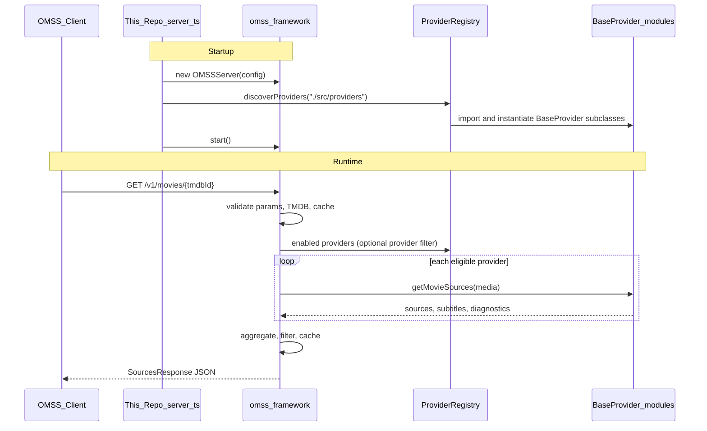

# Architecture

> How this repository maps to official OMSS. Derived from [OMSS_SPEC.md](./OMSS_SPEC.md) and the official ecosystem — not an invented parallel design.
>
> Spec truth: https://omss.mintlify.site/ · OpenAPI v1.1 · [@omss/framework](https://github.com/omss-spec/framework) · [template](https://github.com/omss-spec/template)

---

## 1. Decision: host strategy

**This server is an OMSS provider host built on `@omss/framework`.**

| Option | Verdict |
|--------|---------|
| **A. `@omss/framework` + template patterns** | **Chosen.** Mature Fastify host, official `BaseProvider`, `ProviderRegistry.discoverProviders`, matches providers that exist today. Aligns with project.md preferred stack (Node, TypeScript, Fastify). |
| B. `@omss/core` (beta) | Deferred. Official future for v1.1+, but HTTP/cache/auth plugins are WIP and its `BaseProvider` API differs — existing framework providers would need rewriting, which violates the project golden rule. |
| C. Custom Fastify server + custom provider interface | Rejected. Invents a competing provider architecture. |

When `@omss/core` is production-ready and the ecosystem publishes Core-compatible providers (or a migration path), revisit a Core-based host. Until then, framework is the official way to install/load providers without adapters.

```text
             OFFICIAL OMSS v1.1 HTTP API
                      │
                      ▼
        ┌─────────────────────────────┐
        │  This repository (host app) │
        │  thin consumer of           │
        │  @omss/framework            │
        └─────────────┬───────────────┘
                      │
                      ▼
              @omss/framework
              OMSSServer + routes
              ProviderRegistry
              Source / Proxy / Cache / TMDB
                      │
         ┌────────────┼────────────┐
         ▼            ▼            ▼
   BaseProvider  BaseProvider  BaseProvider
   (drop-in)     (drop-in)     (drop-in)
```

---

## 2. Spec → required components

Official OMSS v1.1 requires these **external** behaviors. Framework already implements most; this app wires, configures, and validates them.

| Spec requirement | Component | Ownership |
|------------------|-----------|-----------|
| `GET /`, `GET /v1` home (`HomeResponse`) | HealthController / HealthService | Framework |
| `GET /v1/movies/{id}` | ContentController → SourceService | Framework |
| `GET /v1/tv/{id}/seasons/{s}/episodes/{e}` | ContentController → SourceService | Framework |
| `POST /v1/refresh/{id}` | Cache invalidation | Framework (verify method/shape vs OpenAPI — see §7) |
| Sources / subtitles / diagnostics models | SourceService aggregation | Framework |
| Provider listing + capabilities | Registry → home payload | Framework |
| `platform`, `provider`, `filter` query params | Content / Source pipeline | Framework (verify v1.1 completeness — see §7) |
| ErrorResponse + codes | OMSSError / error middleware | Framework |
| CORS OPTIONS | Fastify CORS | Framework |
| JSON-only Accept | Validation middleware | Framework |
| Provider packaging (TS `BaseProvider` modules) | `providers/` directory | **This repo** |
| Provider discovery | `registry.discoverProviders(...)` | Framework API, called from this repo |
| TMDB validation | TMDBService + `TMDB_API_KEY` | Framework + env |
| Caching | Memory / Redis CacheService | Framework + config |
| Proxy for `platform=web` URLs | ProxyService + `/v1/proxy` | Framework (spec leaves proxy optional). **Host override:** [`src/proxy/fixed-proxy.ts`](../src/proxy/fixed-proxy.ts) fixes dual `range`/`Range` headers that cause CDN `416`. |

**Not required by OMSS (do not invent as OMSS routes):** search, catalogs, metadata CRUD, series detail APIs, authentication API. Optional **Admin** routes may exist later under a clear non-OMSS prefix.

---

## 3. Runtime requirements

Confirmed from official packages:

| Requirement | Value |
|-------------|--------|
| Runtime | **Node.js ≥ 20.6** (`@omss/framework` engines) |
| Language | **TypeScript** (ESM `"type": "module"`) |
| HTTP | **Fastify** (bundled dependency of `@omss/framework`) |
| Core dependency | `@omss/framework` (pin a current 1.1.x) |
| Config | `dotenv` + env vars (`TMDB_API_KEY` required) |
| Tests | **Vitest** (add in this repo; framework uses Vitest upstream) |
| Containers | Docker + Compose (template already demonstrates Redis pattern) |
| Zod / Pino | Not required for OMSS compliance; add only for admin/custom glue if useful. Framework uses its own request logger. |

Provider compatibility rule: any provider that `extends BaseProvider` from `@omss/framework` and exports a constructable class must load via discovery **without modification**.

---

## 4. Repository layout

Structure follows the official template consumer pattern (OMSS-first), not a parallel `src/omss/` reinvention of the protocol.

```text
omss/                          # this repository
├── project.md                 # product brief
├── TASKS.md                   # phase tracker
├── README.md                  # (Phase 3+)
├── package.json               # depends on @omss/framework
├── tsconfig.json
├── vitest.config.ts
├── .env.example
├── Dockerfile
├── docker-compose.yml
├── docs/
│   ├── OMSS_SPEC.md           # Phase 1
│   ├── ARCHITECTURE.md        # this file
│   ├── PROVIDERS.md           # Phase 4
│   ├── DEVELOPMENT.md
│   └── API.md
├── src/
│   ├── server.ts              # create OMSSServer, discover providers, start
│   └── providers/             # drop-in OMSS BaseProvider modules
│       └── example.ts         # official-style example for compatibility tests
├── tests/
│   ├── unit/
│   └── compatibility/         # load example provider → hit OMSS routes
└── admin/                     # optional, later — not OMSS protocol
```

**Rule:** protocol logic stays inside `@omss/framework`. This repo owns wiring, providers, Docker, tests, and docs.

---

## 5. Request flow (get sources)



Same path for TV via `getTVSources`.

---

## 6. Provider install / lifecycle (official)

1. Author or obtain a provider class extending `BaseProvider` from `@omss/framework`.
2. Install it in one of two ways:
   - **Local:** place the `.ts` file under `src/providers/` (production: `dist/providers`).
   - **Plugin package:** publish/install an npm module that exports `createOmssProviders(config)` (or `BaseProvider` class exports) and list it under `plugins` in `config/providers.json`.
3. Restart (or `POST /admin/providers/reload`) — `ProviderPluginManager` loads local discovery + plugins.
4. Provider appears on `GET /` / `GET /v1` `providers[]`.
5. Disable via provider `enabled` / admin `POST /admin/providers/:id/disable` (omitted from home + not executed).
6. Configure secrets via environment variables or plugin `config` — not hardcoded into the host.

No custom provider interface. Plugins are packaging/distribution only; the runtime type remains `BaseProvider`.

See [PROVIDERS.md](./PROVIDERS.md).

---

## 7. Compliance gaps to close in implementation

`@omss/framework` is the official host for OMSS v1.x, but OpenAPI **v1.1** may be ahead of or differ from the installed framework revision. During Phase 3–4, verify against OpenAPI and fix **in this repo only when necessary** (wrappers, upgrades, or small Fastify hooks via `getInstance()`), never by inventing a parallel API:

| Area | Action |
|------|--------|
| Refresh method | OpenAPI: `POST /v1/refresh/{id}`. Framework currently registers `GET`. Prefer POST per spec; add/align route if needed. |
| Home schema | Ensure `media`, `providers[].capabilities`, `status` enums match OpenAPI `HomeResponse`. |
| Source model | Ensure `streamable`, quality enums (`8K`…`Auto`), UUID `id` fields match v1.1. |
| Query params | Confirm `platform`, `provider`, `filter` behavior matches v1.1. |
| Optional routes | Framework `/v1/proxy`, `/v1/health`, Stremio, MCP are **implementation extras** — keep them; do not document them as required OMSS unless the spec says so. Separate from Admin. |

If a gap is fixed upstream in a newer `@omss/framework`, prefer bumping the dependency over forking.

---

## 8. Admin API (optional, separate)

OMSS does not define admin. If added later:

```text
/admin/*     → server management only (list providers, health, reload, logs)
OMSS routes  → unchanged
```

Admin must not replace or reshape OMSS endpoints or models.

---

## 9. Security posture (host)

Inherited / configured around the framework:

- Secrets in env (`.env` / Compose); never commit keys
- `TMDB_API_KEY` required at startup
- Request validation and OMSS error codes via framework middleware
- Timeouts / rate limits: add at Fastify instance or reverse proxy if needed
- Proxy endpoint: treat as SSRF-sensitive; rely on framework ProxyService patterns and avoid open relay misconfiguration
- Safe logging (no credential leakage)
- CORS configurable; default framework allows broad origins for personal backends (tighten for public deploy)

---

## 10. Testing strategy (maps to later phases)

| Layer | What |
|-------|------|
| Unit | Provider helpers / host wiring if any |
| Compatibility | Discover example `BaseProvider` → start server → `GET /`, movie/TV sources, refresh, error shapes vs OpenAPI |
| Multi-provider | Two providers registered; aggregate + single `?provider=` |
| Failure | One provider throws / returns `PROVIDER_ERROR` diagnostic; others still succeed when possible |
| Docker | `docker compose up -d` serves `/` |

Prefer fixtures from official template/example providers over inventing fake custom interfaces.

---

## 11. Phase mapping

| Phase | Architecture implication |
|-------|--------------------------|
| 3 Core | Scaffold consumer app; configure `OMSSServer`; expose only OMSS (+ framework extras); close §7 gaps |
| 4 Providers | `src/providers` + discovery; document install; compatibility test with example provider |
| 5 Multi-provider | Multiple modules in `providers/`; verify isolation |
| 6 Testing | Vitest suite against OpenAPI behavior |
| 7 Docker | Mirror template Compose (app + optional Redis) |

---

## 12. Explicit non-goals

- Custom `MyProvider` interface unrelated to `BaseProvider`
- Custom provider manifest competing with discovery
- Custom REST API that replaces `/v1/movies` / `/v1/tv/...`
- Custom models that replace OpenAPI schemas
- Rewriting existing framework providers to fit this host
- Building on `@omss/core` before it can host existing providers without rewrite

---

## 13. Golden-rule self-check

| Check | Status |
|-------|--------|
| Uses official provider mechanism? | Yes — `@omss/framework` `BaseProvider` + registry |
| Existing provider installable without rewrite? | Yes — drop into `src/providers/` |
| Custom provider interface? | No |
| Custom competing API? | No — OMSS routes from framework |
| Spec is source of truth for wire format? | Yes — OpenAPI v1.1; framework is the host implementation |

This architecture is: **official OMSS API ← official framework ← official-style providers**, with this repository as the configured host and packaging surface.
